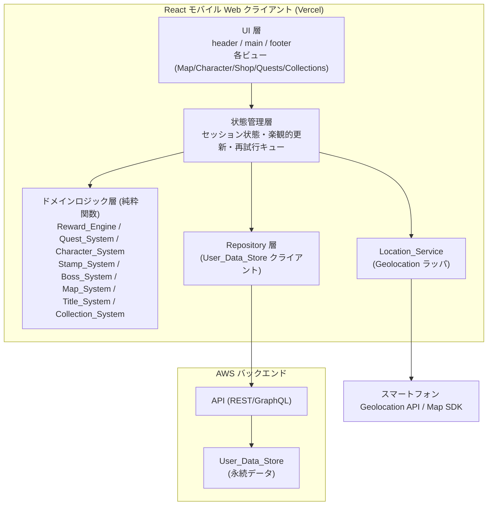
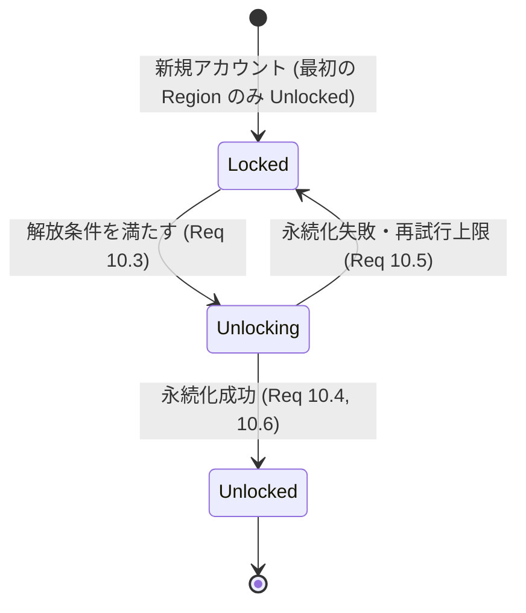
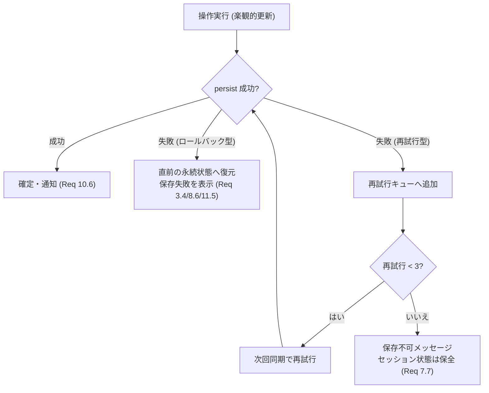

# 設計書（Design Document）

## Overview

Ehime Location RPG は、愛媛県内の実在する観光スポットを実際に訪れることでゲームが進行する、モバイルファーストの React Web アプリケーションです。本設計書は **MVP（Requirements 1〜12）** を主たる成果物として詳細に設計し、同時に **後期フェーズ機能（Requirements 13〜17：フレンド、写真、パーティ、リアルタイムバトル、地域イベント）** を後から無理なく追加できる拡張性を確保することを目的とします。

技術スタックは利用者の指定に従い、以下を前提とします。

- **フロントエンド**: React によるモバイル Web クライアント（スマートフォンのブラウザで動作するモバイルファースト設計）
- **バックエンド**: AWS 上にホストされるデータバックエンド（`User_Data_Store`）
- **デプロイ**: Vercel
- **レイアウト**: header / main / footer 構成のメニューナビゲーションを備えたモダンデザイン

設計の中心的な考え方は、ゲームの状態遷移ロジック（報酬計算、レベル計算、クエスト進行、地域アンロック、コレクション集計など）を **純粋なドメインロジック層** として副作用から分離することです。これにより、位置情報・永続化・UI といった副作用を持つ層と切り離してテスト可能になり、本設計の `Correctness Properties` をプロパティベーステストで検証できるようになります。

### 設計の3つの柱との対応

1. **実在地への移動がゲームそのもの** — `Location_Service` がスポット入場を判定し、`Stamp_System`・`Quest_System`・`Boss_System`・`Map_System` が連動して進行する。
2. **RPG 的な成長感** — `Reward_Engine`・`Character_System`・`Title_System`・`Collection_System` が経験値・コイン・装備・称号・コレクションを通じた成長を提供する。
3. **一緒に遊ぶ** — `Friend_Service`・`Photo_Service`・`Party_Service`（後期フェーズ）が拡張点として用意される。

## Architecture

### 全体構成

本システムは、副作用を持つ層（位置情報・永続化・UI）と、純粋なドメインロジック層を明確に分離するレイヤードアーキテクチャを採用します。これにより、ゲームルールの正しさをドメイン層で集中的に検証できます。



### レイヤーの責務

- **UI 層**: header / main / footer のレイアウトと各ビューの描画。ユーザー操作を状態管理層へ伝える。ドメインルールは持たない。
- **状態管理層**: セッション状態の保持、楽観的更新（optimistic update）、永続化失敗時の再試行キュー管理。ドメイン層を呼び出して次状態を計算する。
- **ドメインロジック層**: ゲームルールを実装する純粋関数群。入力（現在状態＋イベント）から次状態を計算するが、I/O は行わない。`Correctness Properties` の検証対象。
- **`Location_Service`**: ブラウザの Geolocation API をラップし、精度フィルタリングとスポット入場判定の入力を提供する。
- **Repository 層**: `User_Data_Store` への読み書きを抽象化する。ネットワーク・永続化の失敗を状態管理層へ通知する。
- **AWS バックエンド**: プレイヤーのコイン、経験値、所持アイテム、装備、称号、訪問履歴、アンロック状態を永続化する。

### 主要な設計判断とその根拠

- **ドメインロジックを純粋関数に集約**: 報酬計算やレベル計算などのルールを副作用から分離することで、プロパティベーステストで網羅的に検証でき、UI やバックエンドの実装変更に影響されにくくなる。
- **楽観的更新 + 再試行キュー**: モバイル回線での永続化失敗を前提に、`Shop`（Req 7.6/7.7）や `Map_System`（Req 10.5）の要求に沿ってセッション状態を保持しつつ再試行する。
- **永続化を確定の前提条件にする**: スタンプ付与（Req 3.4）、報酬付与（Req 5.7）、地域アンロック（Req 10.4）などは「永続化が成功するまで確定としない」方針で一貫させ、データ整合性を保つ。
- **拡張点の明示**: 後期フェーズのサービス（`Friend_Service` / `Photo_Service` / `Party_Service`）は独立したモジュール境界として確保し、MVP のドメイン層・Repository 層に手を入れずに追加できるようにする。

## Components and Interfaces

以下のインターフェースは TypeScript の型シグネチャで表現します。型名・識別子は英語のままとし、説明は日本語で記述します。

### Location_Service

プレイヤーの地理的位置を取得し、スポット入場を判定します（Req 1）。

```typescript
interface Position {
  lat: number;
  lng: number;
  accuracyMeters: number; // 水平精度
  timestamp: number;
}

interface SpotPresenceResult {
  spotId: string | null; // 現在いるスポット。なければ null (Req 1.5)
}

interface LocationService {
  // 位置を取得。精度が 50m より悪い場合は破棄 (Req 1.1, 1.2)
  getCurrentPosition(): Promise<Position>;
  // 位置と全スポットから入場スポットを判定 (Req 1.3, 1.4, 1.5)
  resolveSpotPresence(position: Position, spots: Spot[]): SpotPresenceResult;
}
```

入場判定は純粋関数 `resolveSpotPresence` に閉じ込めます。精度 50m 超は除外し、複数スポットの `Entry_Radius` に入る場合は中心座標が最も近いスポットのみを選びます（Req 1.4）。

### Spot_Manager

スポット定義・地域・アンロック順序・地域イベントを保持します（Req 1.8, 10.1, 17.1, 17.5）。

```typescript
interface SpotManager {
  getSpot(spotId: string): Spot | undefined;
  listSpots(): Spot[];
  listRegions(): Region[];
  getUnlockOrder(): string[]; // Region id の全順序 (Req 10.1)
  // 地域イベント定義の検証。end <= start は拒否 (Req 17.1, 17.5)
  defineRegionalEvent(event: RegionalEvent): Result<RegionalEvent, EventError>;
}
```

### Stamp_System

スポット訪問によるスタンプの付与・表示を行います（Req 3）。

```typescript
interface StampSystem {
  // 未取得スポットに対してスタンプを1つ付与 (Req 3.1, 3.3)
  grantStampIfAbsent(state: PlayerState, spotId: string, now: ISODateTime): StampGrantResult;
  // 取得数/総数を表示用に集計 (Req 3.5)
  getStampSummary(state: PlayerState, totalSpots: number): { earned: number; total: number };
}

interface StampGrantResult {
  nextState: PlayerState; // 付与後（または据え置き）の状態
  granted: boolean;       // 新規付与されたか
  stamp?: Stamp;
}
```

### Quest_System

クエスト定義・進行・完了を管理します（Req 4）。後期フェーズの地域イベントクエスト（Req 17）もここで可用性を制御します。

```typescript
interface QuestSystem {
  // スタンプ付与イベントを反映し進行を更新 (Req 4.2, 4.3, 4.8)
  applyStamp(quest: QuestProgress, spotId: string): QuestProgress;
  // 完了判定 (Req 4.4)
  isComplete(quest: QuestProgress): boolean;
  // アクティブクエストの表示情報 (Req 4.7)
  getDisplay(quest: QuestProgress): QuestDisplay;
  // 現在時刻に対する可用性 (Req 17.2, 17.3, 17.4)
  isAvailable(quest: QuestDefinition, now: ISODateTime): boolean;
}
```

### Reward_Engine

歩行距離・初回訪問・ボス撃破・クエスト完了からコイン・経験値・アイテムを計算します（Req 4.5, 5）。

```typescript
interface WalkRewardResult {
  coinsGranted: number;       // 完了した 100m ごとに 1 コイン (Req 5.1)
  carryOverMeters: number;    // 100m 未満の繰り越し (Req 5.2)
}

interface RewardGrant {
  coins: number;        // 0 以上 (Req 5.6)
  experience: number;   // 0 以上 (Req 5.6)
  items: string[];
}

interface RewardEngine {
  // 累積距離から付与コインと繰り越しを計算 (Req 5.1, 5.2)
  computeWalkReward(pendingMeters: number, addedMeters: number): WalkRewardResult;
  // 状態へ報酬を適用（純粋）。永続化は Repository 層が担当 (Req 5.5)
  applyReward(state: PlayerState, grant: RewardGrant): PlayerState;
}
```

### Character_System

レベル・経験値・装備・ステータスを管理します（Req 6, 8）。

```typescript
interface CharacterSystem {
  // 累積経験値からレベルを導出 (Req 6.1, 6.2)。1〜99 に丸める
  levelForExperience(experience: number): number;
  // 経験値加算。0 未満になる操作は拒否 (Req 6.6)
  addExperience(state: PlayerState, delta: number): Result<PlayerState, ExperienceError>;
  // 表示情報。最大レベル時は次レベル要求の代わりに到達表示 (Req 6.4, 6.5)
  getProgressDisplay(state: PlayerState): LevelDisplay;
  // 装備の付け替え。所持・スロット適合を検証 (Req 8.3, 8.4)
  equip(state: PlayerState, itemId: string): Result<PlayerState, EquipError>;
  // 有効装備からステータスを再計算 (Req 8.7, 8.8)
  computeStats(state: PlayerState, items: ItemCatalog): CharacterStats;
}
```

### Shop

購入アイテムの一覧表示とコイン取引を行います（Req 7）。`Limited_Item` は一覧から除外します（Req 7.5）。

```typescript
interface Shop {
  // 購入可能アイテム一覧。Limited_Item を除外 (Req 7.5)
  listPurchasable(catalog: ItemCatalog): ShopItem[];
  // 購入処理。残高不足は拒否 (Req 7.2, 7.3)
  purchase(state: PlayerState, item: ShopItem): Result<PurchaseResult, PurchaseError>;
}

interface PurchaseResult {
  nextState: PlayerState; // コイン控除・所持追加後
}
```

### Boss_System

エリアボスとバトル解決を管理します（Req 9）。後期フェーズの共有バトル（Req 16）もこのコンポーネントを拡張します。

```typescript
interface BossSystem {
  // ボスの Spot/Region に入場済みかで可用性を判定 (Req 9.2, 9.7)
  isAvailable(boss: Boss, visited: VisitedAreas): boolean;
  // 勝利時の報酬付与と撃破記録。Limited_Item は未取得時のみ付与 (Req 9.3, 9.4)
  resolveWin(state: PlayerState, boss: Boss): BossWinResult;
}
```

### Map_System

地図描画と地域アンロックを制御します（Req 2, 10）。

```typescript
interface MapSystem {
  // 表示中の解放済み Region 内の解放済み Spot にマーカーを返す (Req 2.2, 2.3)
  getVisibleMarkers(state: PlayerState, spots: Spot[]): MapMarker[];
  // 次の locked Region の解放条件を満たすか (Req 10.3)
  canUnlockNext(state: PlayerState): { regionId: string | null };
  // 解放を状態に反映（永続化成功後に確定する前提） (Req 10.3, 10.4)
  unlockRegion(state: PlayerState, regionId: string): PlayerState;
}
```

### Title_System / Collection_System

称号付与（Req 11.1〜11.5）とコレクション集計（Req 11.6〜11.8）を担当します。

```typescript
interface TitleSystem {
  // 条件を満たし未付与なら付与。既付与なら据え置き (Req 11.2, 11.3)
  grantIfEarned(state: PlayerState, title: TitleDefinition): TitleGrantResult;
}

interface CollectionSystem {
  // 取得数/総数を集計 (Req 11.6)
  getProgress(collection: CollectionDefinition, state: PlayerState): { obtained: number; total: number };
  // 総数 >= 1 かつ取得 == 総数で完了。総数 0 は常に未完了 (Req 11.7, 11.8)
  isComplete(collection: CollectionDefinition, state: PlayerState): boolean;
}
```

### Repository 層（User_Data_Store クライアント）

```typescript
interface UserDataStore {
  load(playerId: string): Promise<PlayerState>;          // Req 12.6, 12.8
  persist(playerId: string, state: PlayerState): Promise<void>; // 失敗を例外で通知
}
```

永続化失敗時の挙動（Req 3.4, 5.7, 7.6, 7.7, 8.6, 10.5, 11.5）は状態管理層が再試行キューと組み合わせて制御します。詳細は Error Handling を参照してください。

### UI 層とナビゲーション

`Application` は header / main / footer のレイアウト（Req 12.1）と、map / character / shop / quests / collections への menu navigation（Req 12.2, 12.3）を提供します。ビューポート 480px 以下では横スクロールを発生させず（Req 12.4）、タッチターゲットを最小 44×44px（Req 12.5）で描画します。

## Data Models

ドメイン層が扱う中核データモデルを示します。`PlayerState` はプレイヤーの永続状態を表す集約ルートで、`User_Data_Store` に保存されます。

```typescript
type ISODateTime = string; // ISO 8601
type Result<T, E> = { ok: true; value: T } | { ok: false; error: E };

// スポット定義 (Req 1.8)
interface Spot {
  id: string;
  name: string;
  description: string;
  center: { lat: number; lng: number };
  entryRadiusMeters: number; // 20〜200 (Req 1.8)
  regionId: string;
  firstVisitReward: RewardGrant; // 初回訪問報酬 (Req 5.3)
}

// 地域定義 (Req 10.1)
interface Region {
  id: string;
  name: string;
  predecessorId: string | null; // 先行 Region。最初の Region のみ null (Req 10.1)
  unlockCondition: UnlockCondition;
}

interface Stamp {
  spotId: string;
  earnedAt: ISODateTime; // Req 3.2
}

// クエスト定義 (Req 4.1)
interface QuestDefinition {
  id: string;
  eventId?: string; // 地域イベント由来の場合 (Req 17)
  // 必須スポット集合（1〜100）またはスタンプ数（1〜100）のいずれか
  condition:
    | { kind: 'spots'; requiredSpotIds: string[] }
    | { kind: 'count'; requiredCount: number };
  reward: RewardGrant; // 完了報酬 (Req 4.5)
}

interface QuestProgress {
  definition: QuestDefinition;
  satisfiedSpotIds: string[]; // 重複カウントしない (Req 4.2, 4.3)
  satisfiedCount: number;
  complete: boolean;          // Req 4.4, 4.8
  rewardGranted: boolean;     // 一度だけ付与 (Req 4.5)
}

interface ShopItem {
  id: string;
  name: string;
  priceCoins: number; // 1〜999,999,999 (Req 7.1)
  effectDescription: string; // 最大 280 文字 (Req 7.1)
  slot: EquipmentSlot;
  statEffects: Partial<CharacterStats>;
  isLimited: boolean; // true は Shop 非表示 (Req 7.5, Limited_Item)
}

type EquipmentSlot = 'weapon' | 'armor' | 'accessory';

interface Boss {
  id: string;
  bind: { kind: 'spot'; spotId: string } | { kind: 'region'; regionId: string }; // Req 9.1
  reward: RewardGrant & { limitedItemIds: string[] }; // 少なくとも1つの Limited_Item (Req 9.1)
}

interface RegionalEvent {
  id: string;
  regionId: string;
  startTime: ISODateTime;
  endTime: ISODateTime; // start より後 (Req 17.1, 17.5)
}

// プレイヤー永続状態（集約ルート）
interface PlayerState {
  playerId: string;
  coins: number;            // 0 以上
  experience: number;       // 0 以上 (Req 6.6)
  stamps: Stamp[];          // Req 3
  ownedItemIds: string[];   // Req 7, 8
  equipped: Record<EquipmentSlot, string | null>; // Req 8
  defeatedBossIds: string[];        // Req 9.5
  grantedLimitedItemIds: string[];  // Req 9.4
  titleIds: string[];               // Req 11
  unlockedRegionIds: string[];      // Req 10.2, 10.4
  quests: QuestProgress[];          // Req 4
  pendingWalkMeters: number;        // 100m 未満の繰り越し (Req 5.2)
}
```

### 状態遷移（地域アンロック）



## Correctness Properties

プロパティとは、システムのすべての正当な実行において成り立つべき特性や振る舞いのことです。すなわち「システムが何をすべきか」についての形式的な言明であり、人間が読む仕様と機械が検証できる正当性保証との橋渡しになります。

本機能は報酬計算・レベル導出・クエスト進行・スタンプ/ボスの重複排除・地域アンロック順序・コレクション集計など、入力に応じて意味のある振る舞いの変化を持つ純粋なドメインロジックを多く含むため、プロパティベーステスト（PBT）が適切です。一方で、地図描画・UI レイアウト・外部サービス連携（Geolocation の取得、Map SDK、バックエンドのレイテンシ）は PBT の対象外とし、Testing Strategy で example / integration テストとして扱います。

各プロパティは prework 分析（上記）に基づき、冗長性を排除して統合しています。プロパティ番号は本書内で一意です。後期フェーズ（Requirements 13〜17）のプロパティは、MVP 完了後の実装に備えて文書化しています。

### Property 1: スポット入場判定の正当性

*For any* プレイヤー位置とスポット集合について、水平精度が 50m より悪い位置では現在スポットを null とし、精度が 50m 以内の位置では `Entry_Radius` 内にスポットが存在しなければ null、存在すれば中心座標が最も近いスポットのみを現在スポットとして返す。

**Validates: Requirements 1.2, 1.3, 1.4, 1.5**

### Property 2: スポット半径定義の制約

*For any* 有効な `Spot` 定義について、その `Entry_Radius` は 20m 以上 200m 以下である（範囲外は検証で拒否される）。

**Validates: Requirements 1.8**

### Property 3: 解放スポットのマーカー対応

*For any* プレイヤー状態とスポット集合について、`Map_System` が返すマーカー集合は、解放済み Region 内かつ解放済みのスポットの集合と正確に一致する。

**Validates: Requirements 2.2**

### Property 4: ロックスポットの情報秘匿

*For any* ロック状態のスポットについて、そのマーカーおよび選択時ペイロードは名前・説明・報酬の詳細をいずれも含まない。

**Validates: Requirements 2.3, 2.5**

### Property 5: 解放スポット詳細の表示内容

*For any* 解放済みスポットについて、選択時の詳細ペイロードは名前・説明・訪問状態（"visited" または "not visited"）を含み、訪問状態はプレイヤーのスタンプ有無と一致する。

**Validates: Requirements 2.4**

### Property 6: スタンプ付与の冪等性

*For any* プレイヤー状態とスポットについて、当該スポットのスタンプを持たない場合は付与によりちょうど1つのスタンプが追加され、既にスタンプを持つ場合は付与を繰り返しても枚数・既存の `spotId` と `earnedAt` が変化しない（付与1回と複数回が同一結果）。

**Validates: Requirements 3.1, 3.3**

### Property 7: スタンプ集計の範囲不変条件

*For any* プレイヤー状態と総スポット数について、表示される取得スタンプ数は 0 以上かつ総数以下であり、保持する相異なるスタンプ数と一致する。

**Validates: Requirements 3.5**

### Property 8: クエスト進行の相異カウント

*For any* クエストとスタンプ付与列（重複を含む）について、進行数は付与された相異なる必須スポット数に等しく、同一スポットを2回以上数えない。

**Validates: Requirements 4.2, 4.3**

### Property 9: クエスト完了の同値条件

*For any* クエスト進行状態について、`isComplete` が真であることは、満たした条件数が必要条件数に等しいことと同値である（いずれかの条件が未達なら未完了）。

**Validates: Requirements 4.4, 4.8**

### Property 10: クエスト報酬の一度限り付与

*For any* クエストについて、完了への遷移およびその後の再評価を通じて、定義されたコインと経験値はちょうど1回だけ付与される。

**Validates: Requirements 4.5**

### Property 11: 歩行コインの累積計算

*For any* 繰り越し距離と追加距離について、付与コインは合計距離を 100 で割った商（切り捨て）に等しく、繰り越し距離は合計を 100 で割った剰余に等しい。さらに距離を任意に分割して逐次適用しても、合計コインは一括適用と等しい（繰り越しが保存される）。

**Validates: Requirements 5.1, 5.2**

### Property 12: 報酬適用の加算不変条件

*For any* プレイヤー状態と報酬付与について、`applyReward` 適用後のコインと経験値は、それぞれ適用前の値に付与量を正確に加えた値になる（初回訪問・ボス撃破・クエスト完了のいずれの報酬源でも成り立つ）。

**Validates: Requirements 5.3, 5.4, 5.5**

### Property 13: 報酬の非負性

*For any* 報酬計算の入力について、算出されるコインは 0 以上、経験値は 0 以上である。

**Validates: Requirements 5.6**

### Property 14: レベル導出の単調・有界性

*For any* 累積経験値 exp（0 以上）について、導出されるレベルは 1 以上 99 以下であり、exp が 0 のときレベルは 1 である。また exp1 <= exp2 ならば level(exp1) <= level(exp2) であり、レベルは 99 を超えない（単一の経験値獲得で複数の閾値を越えた場合も超えない）。

**Validates: Requirements 6.1, 6.2**

### Property 15: レベル表示内容

*For any* プレイヤー状態について、レベルが 99 未満なら表示は現在レベル・現在経験値・次レベルに必要な経験値（正の値）を含み、レベルが 99 なら次レベル要求の代わりに最大到達表示を含む。

**Validates: Requirements 6.4, 6.5**

### Property 16: 経験値の非負拒否

*For any* プレイヤー状態と経験値増減について、結果の経験値が 0 未満になる操作は拒否され、以前の経験値が保持され、無効を示すエラーが返る。

**Validates: Requirements 6.6**

### Property 17: 購入成功時の残高と所持の更新

*For any* プレイヤー状態とアイテムについて、コイン残高がアイテム価格以上なら、購入によりコインは価格分だけ減少し、当該アイテムが所持アイテムに追加される。

**Validates: Requirements 7.2**

### Property 18: コイン不足時の購入拒否

*For any* プレイヤー状態とアイテムについて、コイン残高がアイテム価格未満なら、購入は拒否され、コイン残高と所持アイテムは変化せず、コイン不足を示すエラーが返る。

**Validates: Requirements 7.3**

### Property 19: 限定アイテムのショップ除外

*For any* アイテムカタログについて、`Shop` が返す購入可能一覧は `isLimited` が真のアイテム（`Limited_Item`）を一切含まない。

**Validates: Requirements 7.5**

### Property 20: 装備の付け替え（スロット唯一性）

*For any* 所持アイテムについて、対応スロットへ装備するとそのアイテムがスロットの有効アイテムになり、各スロットの有効アイテムは高々1つで、以前の有効アイテムは解除される。

**Validates: Requirements 8.3**

### Property 21: 無効な装備操作の拒否

*For any* 装備操作について、対象アイテムが未所持であるか対象スロットに適合しない場合、操作は拒否され、スロットの現在の有効アイテムは保持され、無効を示すエラーが返る。

**Validates: Requirements 8.4**

### Property 22: 装備グルーピングの正当性

*For any* 所持装備集合について、表示はスロット別にグループ化され、各アイテムは自身が装備可能なスロットのグループにのみ現れる。

**Validates: Requirements 8.1**

### Property 23: ステータス合成の正当性

*For any* 有効装備の構成について、再計算されるキャラクターステータスは全有効装備のステータス効果の合算に等しく、有効アイテムのないスロットは効果を一切寄与しない。

**Validates: Requirements 8.7, 8.8**

### Property 24: ボス可用性の同値条件

*For any* ボスとプレイヤーの訪問エリアについて、ボスバトルが可用であることは、そのボスが紐づく `Spot` または `Region` に入場済みであることと同値である。

**Validates: Requirements 9.2, 9.7**

### Property 25: ボス勝利時の付与と撃破記録

*For any* 未撃破ボスに勝利した場合、`Reward_Engine` を通じて定義された報酬が付与され、当該ボスがそのプレイヤーの撃破済みとして記録される。

**Validates: Requirements 9.3**

### Property 26: 限定アイテムの重複排除

*For any* ボスへの勝利回数列について、コインと経験値は毎回付与される一方、各 `Limited_Item` は当該プレイヤーに対して高々1回しか付与されない。

**Validates: Requirements 9.4**

### Property 27: 敗北・中断の無作用

*For any* ボスバトルの敗北または中断について、ボスは撃破済みに記録されず、報酬は付与されず、そのボスバトルは可用なまま保たれる。

**Validates: Requirements 9.6**

### Property 28: 地域アンロック順序の構造不変条件

*For any* 地域構成について、アンロック順序は全順序（単一の鎖）であり、最初の Region を除く各 Region はちょうど1つの直前 Region を持ち、循環を含まない。

**Validates: Requirements 10.1**

### Property 29: 新規アカウントの初期アンロック

*For any* 地域構成について、新規作成されたプレイヤー状態ではアンロック順序の最初の Region のみが解放済みで、他のすべての Region はロック状態である。

**Validates: Requirements 10.2**

### Property 30: アンロックの単調性とロック地域の侵入不可

*For any* プレイヤー状態について、次のロック Region の解放条件を満たすとき `unlockRegion` はアンロック順序上の次の Region をちょうど1つ解放し、解放条件が未達の Region はロック状態のまま侵入不可である。

**Validates: Requirements 10.3, 10.7**

### Property 31: 称号付与の冪等性

*For any* プレイヤー状態と称号定義について、達成条件を満たし未付与なら称号が付与され、既に付与済みなら再付与されず既存の称号集合は不変である（付与1回と複数回が同一結果）。

**Validates: Requirements 11.2, 11.3**

### Property 32: コレクション進捗の範囲不変条件

*For any* コレクション定義とプレイヤー状態について、取得数は 0 以上かつ総数以下である。

**Validates: Requirements 11.6**

### Property 33: コレクション完了の同値条件

*For any* コレクションについて、完了であることは、総数が 1 以上かつ取得数が総数に等しいことと同値であり、総数が 0 のコレクションは決して完了しない。

**Validates: Requirements 11.7, 11.8**

### Property 34: 永続化失敗時の状態保全と再試行上限

*For any* プレイヤー状態と永続化を伴う操作（スタンプ付与・報酬付与・購入・装備変更・地域アンロック・称号付与）について、永続化が失敗した場合、確定済み状態は操作前から変化せず、失敗を示すエラー指示が返る。再試行を行う操作は最大3回まで再試行し、3回連続失敗後も対象のセッション状態（保留中の項目）は保全される。

**Validates: Requirements 3.4, 4.6, 5.7, 7.6, 7.7, 8.6, 10.5, 11.5**

### Property 35: プレイヤー状態の永続化ラウンドトリップ

*For any* 有効な `PlayerState` について、`User_Data_Store` へシリアライズして再度デシリアライズすると、コイン・経験値・スタンプ（`spotId` と `earnedAt`）・所持アイテム・スロット別有効装備・撃破済みボス・付与済み限定アイテム・称号・解放済み地域が同値で復元される。

**Validates: Requirements 3.2, 7.4, 8.5, 9.5, 11.4**

### 後期フェーズのプロパティ（Later Phase / 文書化のみ）

以下は Requirements 13〜17 の実装時に PBT 対象とするプロパティです。MVP では実装しません。

### Property 36: フレンド申請の生成

*For any* 自分以外で未フレンドかつ申請が未存在の相手への申請について、送信者から受信者へのペンディング申請がちょうど1件記録される。

**Validates: Requirements 13.1**

### Property 37: フレンド承認のラウンドトリップ

*For any* ペンディング申請の承認について、両者間に相互フレンド関係が成立し、当該ペンディング申請は除去される。

**Validates: Requirements 13.2**

### Property 38: 無効なフレンド申請の拒否

*For any* 自分自身・既フレンド・既ペンディングのいずれかに該当する申請について、ペンディングは作成されず、送信不可を示すメッセージが返る。

**Validates: Requirements 13.3**

### Property 39: 同意ベースの位置共有可視性

*For any* 2プレイヤーについて、共有同意があり相互距離が 500m 以内のときのみ位置が 100m より細かくない粒度に丸めて共有され、同意がない、または距離が 500m を超える場合は位置も近接指標も一切共有されない。

**Validates: Requirements 13.4, 13.5**

### Property 40: 同意取り消しによる共有停止

*For any* 共有中のフレンド関係について、同意を取り消すと当該フレンドへの位置共有が停止する。

**Validates: Requirements 13.6**

### Property 41: 写真投稿の検証と保存内容

*For any* 写真投稿について、サイズが 10MB 以下・対応形式・既存スポット参照のすべてを満たす場合は `spotId`・著者識別子・投稿時刻を伴って保存され、いずれかを満たさない場合は拒否され部分データを残さず理由を示すエラーが返る。

**Validates: Requirements 14.1, 14.2**

### Property 42: 写真フィードの順序とページング

*For any* 投稿写真集合について、フィードは1ページ最大20件で、投稿時刻の降順に整列され、ページ間で重複や欠落がない。

**Validates: Requirements 14.4**

### Property 43: いいねの冪等性

*For any* プレイヤーと写真について、初回のいいねはいいね数をちょうど1増やしてプレイヤーを記録し、同一プレイヤーの再いいねはいいね数を変えず既いいねを示す指示を返す。

**Validates: Requirements 14.5, 14.6**

### Property 44: パーティの定員と解散

*For any* 50m 以内の同意フレンド集合について、パーティ人数は最大4人を超えず、4人未満なら参加が成立し、4人なら参加は満員として拒否され既存メンバーは不変である。最後のメンバーが退出すると（残り0人）パーティは解散される。

**Validates: Requirements 15.1, 15.2, 15.3, 15.4, 15.5**

### Property 45: 共有バトルの定員と報酬

*For any* 共有ボスバトルについて、アクティブ参加者は最大4人を超えず、4人未満なら参加が成立し満員なら拒否される。勝利時には勝利時点のアクティブ参加者各人にちょうど1回報酬が付与され、敗北または600秒の時間切れではいずれの参加者にも報酬を付与しない。

**Validates: Requirements 16.1, 16.2, 16.3, 16.5**

### Property 46: 地域イベントの可用時間窓

*For any* 地域イベントについて、イベントクエストが可用であることは、現在時刻が開始時刻以上かつ終了時刻未満であることと同値であり、終了時刻が開始時刻以下のイベントは拒否され決して可用にならない。

**Validates: Requirements 17.2, 17.3, 17.4, 17.5**

### Property 47: イベント終了時の進行停止

*For any* 進行中のイベントクエストについて、現在時刻がイベント終了時刻に達すると以降の進行が停止し、未達成クエストに対する報酬は付与されない。

**Validates: Requirements 17.6**

## Error Handling

エラーは「ドメイン検証エラー」「永続化／ネットワークエラー」「外部サービスエラー」の3種に分類し、それぞれ一貫した方針で扱います。

### ドメイン検証エラー（Result 型で表現）

無効な操作はドメイン層で `Result<T, E>` の失敗値として返し、状態を変更しません。該当する要求は、コイン不足の購入（Req 7.3）、未所持・不適合スロットへの装備（Req 8.4）、経験値を負にする操作（Req 6.6）、無効なフレンド申請（Req 13.3）、不正な写真投稿（Req 14.2）、満員パーティ／バトルへの参加（Req 15.3, 16.2）などです。UI 層はエラー種別に応じた日本語メッセージを表示します。

### 永続化・ネットワークエラー（楽観的更新と再試行キュー）

`User_Data_Store` への書き込み失敗時は「確定前ロールバック」を基本方針とします。

- **確定前にロールバック**: スタンプ（Req 3.4）、報酬（Req 5.7, 4.6）、装備（Req 8.6）、地域アンロック（Req 10.4, 10.5）、称号（Req 11.5）は、永続化が成功するまで「獲得・確定」として扱わず、失敗時は直前の永続済み状態へ戻し、保存失敗を示す指示を表示します。
- **再試行キュー（最大3回）**: 購入（Req 7.6, 7.7）と地域アンロック（Req 10.5）は、セッション状態に保留項目を保持し、次回の同期で最大3回まで再試行します。3回連続失敗後は保存不可メッセージを表示しつつ、セッション状態（購入済みアイテム・更新後残高など）を保全します。



### 外部サービスエラー（Geolocation / Map / 初期ロード）

- **位置情報**: 権限拒否時はスタンプ獲得に位置が必要である旨を表示（Req 1.6）。30秒以内に精度50m以内の位置を取得できない場合は再試行を提示し、既存のスポット入場状態を保持（Req 1.7）。
- **地図**: 10秒以内に地図の読み込み・センタリングができない場合は読み込み失敗メッセージと再試行を提示（Req 2.7）。位置が無い場合は愛媛県内の既定座標にセンタリング（Req 2.6）。
- **初期データ取得**: 取得中はメインコンテンツ領域にローディング表示（Req 12.7）。10秒以内に完了しない場合は読み込み失敗メッセージと再試行を提示（Req 12.8）。

## Testing Strategy

ユニットテストとプロパティテストを併用する二層構成を採用します。プロパティテストはあらゆる入力にわたる普遍的性質を、ユニット／インテグレーションテストは具体例・エッジケース・外部連携を検証します。

### プロパティベーステスト（PBT）

- **対象**: 上記 Correctness Properties の各プロパティ。MVP では Property 1〜35 を実装します（Property 36〜47 は後期フェーズ）。
- **ライブラリ**: TypeScript 向けの確立された PBT ライブラリ（fast-check）を使用します。PBT を自前実装しません。
- **反復回数**: 各プロパティテストは最低100回反復します。
- **対応付け**: 各プロパティテストは1つの Correctness Property を単一のプロパティテストとして実装し、設計書のプロパティ番号を参照するコメントを付与します。
- **タグ形式**: `Feature: ehime-location-rpg, Property {number}: {property_text}`
- **ジェネレータ**: `Spot`（半径20〜200m, Req 1.8）、`QuestDefinition`（必須スポット1〜100 または カウント1〜100, Req 4.1）、`ShopItem`（価格1〜999,999,999・効果説明280文字以内, Req 7.1）、`Boss`（単一バインド・限定アイテム1個以上, Req 9.1）、`RegionalEvent`（end>start, Req 17.1）、緯度経度・精度を含む `Position` を生成するジェネレータを用意し、エッジケース（精度ちょうど50m、半径境界、経験値0/最大、コレクション総数0、距離の100m境界、非ASCII文字列）を含めます。

### ユニットテスト（具体例・エッジケース）

prework で EXAMPLE / EDGE_CASE に分類した受け入れ基準を対象とします。位置権限拒否メッセージ（Req 1.6）、タイムアウト再試行（Req 1.7）、既定座標センタリング（Req 2.6）、購入確定メッセージ（Req 7.8）、空スロットの空状態表示（Req 8.2）、アンロック永続化後の通知順序（Req 10.4, 10.6）、ローディング表示（Req 12.7）、データ取得失敗メッセージ（Req 12.8）などです。

### インテグレーション／スモークテスト（PBT 非対象）

入力で意味が変わらない、または外部サービスに依存する基準を対象とします。Geolocation 取得（Req 1.1）、地図のセンタリング時間（Req 2.1）と読み込み失敗（Req 2.7）、レイアウト3領域（Req 12.1）とメニュー遷移（Req 12.2, 12.3）、480px でのレイアウト（横スクロール抑止 Req 12.4・タッチターゲット44×44px Req 12.5）、初期データ取得時間（Req 12.6）を、モックまたは実環境に対する少数例（1〜3件）で検証します。

### PBT 非適用範囲の明示

地図描画・UI レイアウト・レスポンシブ表示・外部サービス連携（Geolocation、Map SDK、バックエンドのレイテンシ）は普遍的な「for all 入力」の言明が立てにくいため PBT の対象外とし、スナップショット／レンダリングテストおよびインテグレーションテストで担保します。
