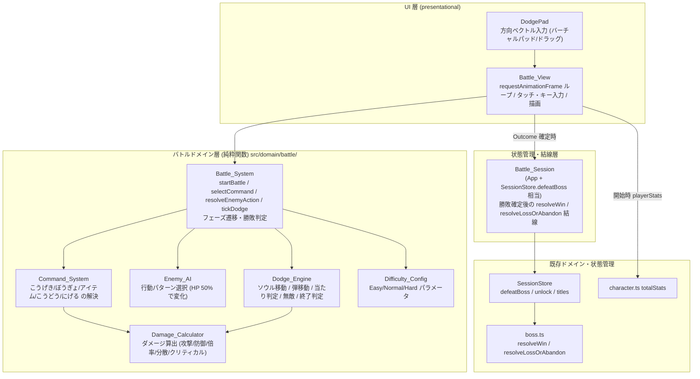
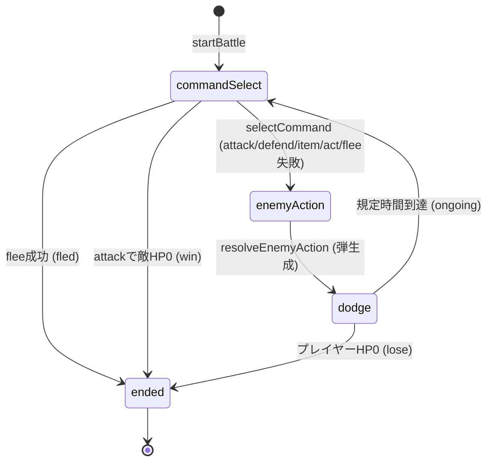

# 設計書（Design Document）

## Overview

本設計書は、既存の位置情報RPG「愛媛ロケーションRPG」へ追加する **アンダーテイル風ターン制バトルシステム** の詳細設計を定義する。要件定義（`requirements.md` Req 1〜20）を実装可能な構造へ落とし込む。

バトルの基本ループは「コマンド選択 → コマンド結果 → 敵行動 → 避けフェーズ（リアルタイム弾幕回避）→ ダメージ判定 → 勝敗判定」である。

### 設計の中心方針

既存プロジェクトのアーキテクチャ（副作用なしの純粋ドメイン関数 + fast-check プロパティテスト）を踏襲する。

- **判定ロジックはすべて純粋関数**: コマンド解決・ダメージ計算・弾の移動・当たり判定・フェーズ遷移・敵行動選択・勝敗判定は、入力 `BattleState` を破壊的に変更せず次状態を返す。I/O・乱数の暗黙利用・時刻取得を行わない。
- **乱数は注入**: すべての確率処理は `Rng = () => number`（`[0,1)`）を引数で受け取り、テストで決定論的に固定する。
- **リアルタイム性は「経過時間を引数に取る純粋関数」で表現**: 弾やソウルの移動は `tickDodge(state, dtMs, input, rng)` のように経過時間 `dtMs` を入力に取る純粋関数で表す。`requestAnimationFrame` ループ・キー/タッチ入力・描画は presentational UI（`Battle_View`）が担う。
- **入力は抽象化**: ソウル移動の入力は「方向ベクトル（正規化された `{x, y}`）」として抽象化する。モバイルのタッチ操作（バーチャルパッド／ドラッグ）を主とし、PC のキーボードも同じ方向ベクトルへ写像できる。ドメインは入力デバイスを知らない。
- **報酬・永続化は委譲**: 勝敗確定後の報酬付与・撃破記録・称号評価・アンロックは既存の `boss.ts`（`resolveWin` / `resolveLossOrAbandon`）と `SessionStore.defeatBoss` 相当の結線に委譲する。バトルドメインは `PlayerState` を直接変更しない。

### MVP スコープ

- 敵は常に **1 体**（Req 1）。複数敵・召喚・パーティ戦は対象外。
- UI は **仮の見た目**（最小スタイル）で動作確認を優先する。凝った演出はテキストログで代替（Req 18）。
- アイテムは **最小**（デモ用の固定回復アイテム 1 種、バトル内使用回数制限つき）。

### 旧実装の置き換え

以前のセミオート案の成果物（`src/domain/battle.ts` / `src/domain/battle.test.ts` / `src/ui/views/BattleView.tsx` / `src/ui/views/BattleView.css`）は本設計で **破棄・置き換え** する。新実装はバトル領域を 1 つのサブフォルダ `src/domain/battle/` に集約する。

## Architecture

### レイヤー構成



### レイヤーの責務

- **Battle_View（UI）**: バトル画面の描画。`requestAnimationFrame` で `tickDodge` を駆動し、タッチ/キー入力を方向ベクトルへ変換して渡す。判定は一切持たず、純粋関数の結果を描画するのみ。Outcome 確定時に `Battle_Session` へ通知する。
- **Battle_Session（状態管理・結線）**: バトル開始時にプレイヤーの `totalStats` と敵定義を渡して `startBattle` を呼ぶ。Outcome が `win` なら `SessionStore.defeatBoss`（内部で `resolveWin` → アンロック → 称号評価）を呼び、`lose`/`fled` なら `resolveLossOrAbandon` 相当（無作用）とする。
- **バトルドメイン層（純粋関数）**: 本設計の中核。`Correctness Properties` の検証対象。
- **既存層**: 報酬・永続化・キャラステータスは既存実装を流用する。

### モジュール配置

```
src/domain/battle/
  types.ts        // BattleState, Combatant, Phase, Outcome, Soul, Bullet, DodgeArea, Command, BattleItem, EnemyDefinition など
  difficulty.ts   // Difficulty_Config（Easy/Normal/Hard）
  damage.ts       // Damage_Calculator
  enemyAI.ts      // Enemy_AI（行動パターン選択・弾生成）
  dodge.ts        // Dodge_Engine（tickDodge とその補助）
  command.ts      // Command_System（5 コマンドの解決）
  battle.ts       // Battle_System（startBattle / selectCommand / resolveEnemyAction / フェーズ遷移・勝敗判定）
  index.ts        // 公開 API の再エクスポート
  *.test.ts       // 各モジュールのプロパティ/単体テスト
src/data/
  enemyContent.ts // 敵定義（MVP: 1 体）と難易度・バトルアイテムのサンプル定義
src/ui/views/
  BattleView.tsx  // 置き換え（旧実装を削除）
  BattleView.css
  DodgePad.tsx    // 方向ベクトル入力（タッチ/キー）
```

### 主要な設計判断と根拠

- **フェーズを明示的な状態機械にする**: `Phase` を `commandSelect / enemyAction / dodge / resolve / ended` の列挙とし、各遷移関数が「許可された Phase でのみ作用し、それ以外では状態不変」を保証する（Req 3.3, 16.3, 20.1）。これにより誤操作・連打・決着後入力に対する堅牢性をプロパティで検証できる。
- **避けフェーズを `dtMs` 駆動の純粋関数に**: リアルタイム処理を「経過時間を引数に取る純粋関数」に閉じ込めることで、アニメーションループから切り離して決定論的にテストできる。`dt` の分割適用と一括適用の一致（合流性）を検証する（Req 11 テスト観点）。
- **入力の抽象化（方向ベクトル）**: デバイス非依存にすることで、モバイルタッチと PC キーボードの両対応を UI 層だけで吸収する。
- **乱数注入**: 敵行動・ダメージ分散・逃走判定・クリティカル・弾配置のばらつきをすべて注入 RNG で評価し、モデルベース/決定性テストを可能にする。

## Components and Interfaces

型名・識別子は英語、説明は日本語とする（既存方針に準拠）。

### 共通型・基本データ

```typescript
/** 注入可能な乱数。[0,1) を返す。テストで決定論的に固定する。 */
export type Rng = () => number;

/** 2 次元ベクトル（避けエリア座標系。原点は左上、+x 右・+y 下）。 */
export interface Vec2 { x: number; y: number; }

/** 戦闘参加者（プレイヤー/敵）の戦闘パラメータと現在 HP。HP は 0..maxHp の整数。 */
export interface Combatant {
  maxHp: number;
  hp: number;
  attack: number;
  defense: number;
  speed: number;
}

/** バトルの現在段階。 */
export type Phase = 'commandSelect' | 'enemyAction' | 'dodge' | 'resolve' | 'ended';

/** バトルの決着結果。 */
export type Outcome = 'ongoing' | 'win' | 'lose' | 'fled';

/** 難易度。 */
export type DifficultyId = 'easy' | 'normal' | 'hard';
```

### Difficulty_Config

難易度ごとの戦闘パラメータを保持する（Req 19）。

```typescript
export interface DifficultyConfig {
  /** 弾速スケール（弾の基準速度に乗算）。Easy<=Normal<=Hard。 */
  bulletSpeedScale: number;
  /** 弾数スケール（パターンの基準弾数に乗算し四捨五入）。Easy<=Normal<=Hard。 */
  bulletCountScale: number;
  /** 予兆時間（ms）。弾が動き出すまでの猶予。Easy>=Normal>=Hard。 */
  telegraphMs: number;
  /** ダメージ係数（被ダメージに乗算）。Easy<=Normal<=Hard。 */
  damageScale: number;
  /** ソウル移動速度（px/ms）。Easy>=Normal>=Hard。 */
  soulSpeed: number;
}

/** 3 難易度の定義。単調関係（Req 19.3, 19.4, 19.5）を満たす固定値。 */
export const DIFFICULTY: Record<DifficultyId, DifficultyConfig>;

export function getDifficulty(id: DifficultyId): DifficultyConfig;
```

### Damage_Calculator

ダメージ量を算出する純粋関数（Req 14）。

```typescript
export interface DamageInput {
  attack: number;
  defense: number;
  /** 基本倍率（コマンドや弾の係数）。 */
  multiplier: number;
  /** 難易度のダメージ係数（被ダメージ側に適用、攻撃側計算では 1）。 */
  damageScale?: number;
  /** ぼうぎょなどの軽減係数（0<r<1）。未指定は 1。 */
  mitigation?: number;
  /** クリティカル発生確率（0..1）。未指定は 0。 */
  critChance?: number;
  /** クリティカル倍率（>=1）。未指定は 1。 */
  critMultiplier?: number;
}

/**
 * ダメージを算出する。raw = attack * multiplier * variance - defense/2 を基本に、
 * クリティカル・難易度係数・軽減係数を適用し、1 以上の整数へクランプする（Req 14.1, 14.2）。
 * variance は [VARIANCE_MIN, 1) の乱数で揺らす。同一入力（RNG 値含む）で同一結果（Req 14.4）。
 */
export function computeDamage(input: DamageInput, rng: Rng): number;
```

### 敵定義・バトルアイテム

```typescript
/** 弾の生成仕様（行動パターンが持つ）。実際の Bullet は generateBullets で具体化する。 */
export interface BulletSpawnSpec {
  /** 基準の弾数（難易度の bulletCountScale を乗算）。 */
  count: number;
  /** 基準の弾速（px/ms。難易度の bulletSpeedScale を乗算）。 */
  speed: number;
  /** 弾の当たり判定半径（px）。 */
  radius: number;
  /** 出現パターン種別（MVP: 上方からの直下降 'rain' / 左右からの横断 'sweep'）。 */
  pattern: 'rain' | 'sweep';
  /** この弾が当たったときのダメージ倍率。 */
  damageMultiplier: number;
}

/** 敵の 1 行動（攻撃パターン）。 */
export interface EnemyActionPattern {
  id: string;
  /** この行動時のメッセージ（Req 18.2）。 */
  message: string;
  /** 生成する弾仕様。 */
  spawn: BulletSpawnSpec;
  /** この行動の避けフェーズ規定時間（ms, Req 13.4）。 */
  dodgeDurationMs: number;
}

/** こうどう（ACT）の選択肢（Req 7）。 */
export interface ActOption {
  id: string;
  label: string;
  /** 選択時にログへ出すメッセージ（様子を見る等, Req 7.2）。 */
  message: string;
  /** 戦闘条件への影響（任意）。被ダメージ/敵行動/勝敗への効果（Req 7.3）。 */
  effect?: ActEffect;
}

/** こうどうの効果（MVP は最小。必要に応じ拡張）。 */
export type ActEffect =
  | { kind: 'none' }
  | { kind: 'sparable'; /** 見逃し可能フラグを立てる（将来の MERCY 拡張用） */ };

/** 敵定義（MVP: 1 体）。 */
export interface EnemyDefinition {
  id: string;
  name: string;
  stats: CharacterStats; // 既存型。startBattle で Combatant 化
  /** 通常時の行動パターン集合（HP > 50%, Req 9.2）。 */
  normalPatterns: EnemyActionPattern[];
  /** 変化後の行動パターン集合（HP <= 50%, Req 9.3）。 */
  enragedPatterns: EnemyActionPattern[];
  /** こうどう選択肢（Req 7.1）。 */
  actOptions: ActOption[];
  /** 逃走成功の基準確率（0..1, Req 8.4）。 */
  fleeChance: number;
  /** 各種演出メッセージ（Req 18）。 */
  messages: {
    start: string;        // 戦闘開始 (Req 18.1)
    playerLowHp: string;  // HP 低下 (Req 18.3)
    win: string;          // 勝利 (Req 18.4)
    lose: string;         // 敗北 (Req 18.5)
  };
}

/** バトルで使用する消費アイテム（MVP: 固定回復 1 種）。 */
export interface BattleItem {
  id: string;
  name: string;
  /** 回復量（HP）。 */
  healAmount: number;
  /** このバトル内の残り使用回数（Req 6.4, 6.5）。 */
  usesRemaining: number;
}
```

### 避けフェーズの状態

```typescript
/** 避けエリア（矩形。原点 (0,0) は左上）。 */
export interface DodgeArea { width: number; height: number; }

/** プレイヤーの当たり判定オブジェクト。 */
export interface Soul { pos: Vec2; radius: number; }

/** 敵弾。velocity は px/ms。 */
export interface Bullet {
  id: string;
  pos: Vec2;
  velocity: Vec2;
  radius: number;
  damageMultiplier: number;
}

/** 避けフェーズの状態。 */
export interface DodgeState {
  area: DodgeArea;
  soul: Soul;
  bullets: Bullet[];
  /** 累積経過時間（ms）。 */
  elapsedMs: number;
  /** このターンの規定時間（ms, Req 13.1, 13.4）。 */
  durationMs: number;
  /** 予兆時間（ms）。elapsedMs < telegraphMs の間は弾を動かさない（Req 11.4 関連）。 */
  telegraphMs: number;
  /** 無敵終了時刻（ms, elapsedMs 基準）。elapsedMs < invincibleUntilMs の間は無敵（Req 12.3, 12.4）。 */
  invincibleUntilMs: number;
}
```

### コマンド

```typescript
/** プレイヤーコマンド（Req 3.1）。 */
export type Command =
  | { kind: 'attack' }
  | { kind: 'defend' }
  | { kind: 'item'; itemId: string }
  | { kind: 'act'; optionId: string }
  | { kind: 'flee' };
```

### BattleState（集約）

```typescript
export interface BattleState {
  phase: Phase;
  outcome: Outcome;
  /** 経過ターン数（コマンド選択を 1 ターンと数える）。 */
  turn: number;
  player: Combatant;
  enemy: Combatant;
  enemyDef: EnemyDefinition;
  difficulty: DifficultyId;
  /** ぼうぎょ中フラグ。次の被ダメージ計算で軽減し、適用後に解除（Req 5.1, 5.2）。 */
  defending: boolean;
  /** バトルアイテムの残量。 */
  items: BattleItem[];
  /** 避けフェーズ状態。dodge 以外の Phase では null。 */
  dodge: DodgeState | null;
  /** 直近で選ばれた敵行動（避けフェーズの弾生成元）。 */
  currentPattern: EnemyActionPattern | null;
  /** メッセージログ（古い順, Req 18.6）。 */
  log: string[];
  /** HP 低下メッセージを既に出したか（重複防止）。 */
  lowHpNotified: boolean;
}
```

### Battle_System（公開 API）

```typescript
/** バトル開始（Req 2）。プレイヤー合計ステータスと敵定義から初期 BattleState を生成。 */
export function startBattle(
  playerStats: CharacterStats,
  enemyDef: EnemyDefinition,
  difficulty: DifficultyId,
  items?: BattleItem[]
): BattleState;

/** こうげき可能なコマンド一覧を返す（Phase が commandSelect のときのみ非空）。 */
export function availableCommands(state: BattleState): Command['kind'][];

/**
 * コマンドを選択・解決する（Req 3, 4, 5, 6, 7, 8）。
 * - commandSelect 以外、または未定義/無効コマンドでは状態不変（Req 3.3, 3.4, 20.1, 20.3）。
 * - 解決後、勝敗が付かなければ Phase を enemyAction へ遷移。にげる成功は ended(fled)。
 */
export function selectCommand(state: BattleState, command: Command, rng: Rng): BattleState;

/**
 * 敵行動を解決する（Req 9）。Enemy_AI が行動を選び、弾仕様を確定して Phase を dodge へ遷移。
 * enemyAction 以外では状態不変。
 */
export function resolveEnemyAction(state: BattleState, rng: Rng): BattleState;

/**
 * 避けフェーズを dtMs ぶん進める（Req 10, 11, 12, 13）。
 * - ソウル移動・弾移動・画面外除去・当たり判定・被ダメージ・無敵・終了判定を行う。
 * - dtMs が負/非有限なら 0 として扱い状態不変（Req 20.5）。
 * - 規定時間到達で commandSelect へ、HP 0 で ended(lose) へ遷移（Req 13）。
 * - dodge 以外では状態不変。
 * @param inputDir 正規化された移動方向（無入力は {x:0,y:0}）。
 */
export function tickDodge(
  state: BattleState,
  dtMs: number,
  inputDir: Vec2,
  rng: Rng
): BattleState;
```

### Command_System（内部 API、battle.ts から利用）

```typescript
export function resolveAttack(state: BattleState, rng: Rng): BattleState;   // Req 4
export function resolveDefend(state: BattleState): BattleState;             // Req 5
export function resolveItem(state: BattleState, itemId: string): BattleState; // Req 6
export function resolveAct(state: BattleState, optionId: string): BattleState; // Req 7
export function resolveFlee(state: BattleState, rng: Rng): BattleState;     // Req 8
```

### Enemy_AI

```typescript
/** HP 割合で通常/変化パターン集合を選び、RNG で 1 つ選択する（Req 9.1〜9.4）。 */
export function selectEnemyAction(state: BattleState, rng: Rng): EnemyActionPattern;

/** 行動パターンと難易度から初期 Bullet 集合を生成する（Req 9.5, 11.4, 19.2）。 */
export function generateBullets(
  pattern: EnemyActionPattern,
  difficulty: DifficultyConfig,
  area: DodgeArea,
  rng: Rng
): Bullet[];
```

### Dodge_Engine（内部 API）

```typescript
/** ソウル移動（Req 10）。境界クランプつき。dt<=0 で不変。 */
export function moveSoul(soul: Soul, inputDir: Vec2, soulSpeed: number, dtMs: number, area: DodgeArea): Soul;

/** 弾移動 + 画面外除去（Req 11）。 */
export function advanceBullets(bullets: Bullet[], dtMs: number, area: DodgeArea): Bullet[];

/** 当たり判定（2 円の距離 <= 半径和, Req 12.1）。 */
export function detectHit(soul: Soul, bullets: Bullet[]): boolean;

/** Battle_View が呼ぶのは Battle_System.tickDodge のみ。上記は tickDodge の内部分解。 */
```

### Battle_View（UI）

```typescript
export interface BattleViewProps {
  enemyDef: EnemyDefinition;
  playerStats: CharacterStats;
  difficulty: DifficultyId;
  /** 勝利時（報酬付与・撃破記録を親が実行）。 */
  onWin: () => void;
  /** 敗北/逃走/中断（状態不変で閉じる）。 */
  onClose: (outcome: Exclude<Outcome, 'ongoing' | 'win'>) => void;
}
```

`Battle_View` の責務:
- `useState<BattleState>` で状態を保持。`startBattle` で初期化。
- `commandSelect` フェーズではコマンドボタンを表示し、押下で `selectCommand` → `resolveEnemyAction` を順に適用して `dodge` へ。
- `dodge` フェーズでは `requestAnimationFrame` ループで前フレームからの `dtMs` を計測し、`DodgePad` からの方向ベクトルとともに `tickDodge` を呼ぶ。一時停止中（タブ非表示等）は `dtMs` を渡さない＝状態保持（Req 20.4）。
- `outcome` 確定で `onWin` / `onClose` を呼ぶ。

## Data Models

### 状態遷移図（フェーズ）



注: `resolve` フェーズは「ダメージ判定の論理段階」を表す概念上の段階で、実装上は各遷移関数内のダメージ適用ステップに対応する（独立した滞留状態を作らず、`dodge` 内の被弾処理・`commandSelect→enemyAction` 内の与ダメージ処理として吸収する）。

### 座標系と避けエリア

- 避けエリアは矩形 `DodgeArea`（原点 (0,0) 左上、+x 右、+y 下）。論理単位は px。
- `Soul` と `Bullet` は円（中心 `pos`・半径 `radius`）。当たり判定は中心間距離と半径和の比較。
- 速度 `velocity` は px/ms。位置更新は `pos += velocity * dtMs`。

### 既存型との関係

- `CharacterStats`（既存 `domain/types.ts`）: `attack/defense/hp/speed`。`startBattle` で `Combatant`（`maxHp=hp, hp=maxHp`）へ変換。
- `Boss`（既存）: `stats?: CharacterStats` を持つ。敵定義 `EnemyDefinition` は `Boss` から導出するか、`enemyContent.ts` で別途定義し `Boss.id` と対応づける。未設定時は既定ステータスへフォールバック（Req 2.3）。
- 勝敗確定後は `Boss.id` をキーに既存 `SessionStore.defeatBoss(bossId)` を呼ぶ（Req 17）。

### 定数（初期バランス・デモ用）

```typescript
const VARIANCE_MIN = 0.85;          // ダメージ分散下限
const DEFAULT_ENEMY_STATS = { hp: 120, attack: 16, defense: 8, speed: 8 }; // Req 2.3
const DEFEND_MITIGATION = 0.5;      // ぼうぎょ軽減係数 (Req 5)
const INVINCIBILITY_MS = 700;       // 被弾後無敵時間 (Req 12.3)
const LOW_HP_RATIO = 0.3;           // HP 低下メッセージ閾値 (Req 18.3)
const ENRAGE_RATIO = 0.5;           // 行動パターン変化閾値 (Req 9.2, 9.3)
```

## Correctness Properties

各プロパティは要件の「テスト観点」に対応する。fast-check で各 100 回反復を基本とする。

### Property 1: 単一敵の不変条件
**Validates: Requirements 1.1, 1.2**

任意のプレイヤー/敵ステータス入力に対し、`startBattle` の戻り値は敵をちょうど 1 体（単一 `enemy`）持つ。

### Property 2: 初期状態の不変条件
**Validates: Requirements 2.4, 2.5, 2.6**

`startBattle` の戻り値は、`player.hp == player.maxHp` かつ `enemy.hp == enemy.maxHp`、両者の `maxHp >= 1` の整数、`phase == 'commandSelect'`、`outcome == 'ongoing'` を満たす。

### Property 3: フェーズガード
**Validates: Requirements 3.3, 20.1**

`phase != 'commandSelect'` のとき、`selectCommand` は状態を変更しない（同一参照または内容一致）。同様に `resolveEnemyAction` は `enemyAction` 以外で、`tickDodge` は `dodge` 以外で状態不変。

### Property 4: 未定義/無効コマンド拒否
**Validates: Requirements 3.4, 6.5, 20.3**

未定義コマンド種別、存在しない `itemId`/`optionId`、使用回数 0 のアイテムに対し、`selectCommand` は状態不変。

### Property 5: HP クランプ不変条件
**Validates: Requirements 4.2, 6.3, 12.5, 15.1, 15.2**

任意のコマンド列・`tickDodge` 列の後でも、`player.hp ∈ [0, player.maxHp]` かつ `enemy.hp ∈ [0, enemy.maxHp]`（整数）。

### Property 6: こうげきと勝利
**Validates: Requirements 4.1, 4.3, 4.4, 16.1**

こうげき解決で敵 HP が 0 になった場合に限り、`outcome == 'win'` かつ `phase == 'ended'`。0 より大きければ `phase == 'enemyAction'`。

### Property 7: ぼうぎょの軽減（メタモルフィック）
**Validates: Requirements 5.1, 5.2, 5.3, 12.6**

同一の被弾条件において、`defending == true` で算出される被ダメージは `defending == false` の被ダメージ以下。かつ軽減は 1 回適用後に解除され次ターンへ持ち越さない。

### Property 8: 回復の上限クランプ
**Validates: Requirements 6.2, 6.3, 6.4**

任意の回復量・現在 HP に対し、アイテム使用後の `player.hp <= player.maxHp`。使用後 `usesRemaining` は 1 減少。

### Property 9: こうどうの非攻撃性と遷移
**Validates: Requirements 7.1, 7.2, 7.4**

「様子を見る」を含むこうどう解決は敵 HP を増減させない。こうどう解決後は必ず `phase == 'enemyAction'`。

### Property 10: 逃走の決定性と確率域
**Validates: Requirements 8.1, 8.2, 8.3, 8.4**

固定 RNG・固定 `fleeChance` に対し、`resolveFlee` の成否は決定的。`fleeChance ∈ [0,1]`。成功で `outcome == 'fled'`、失敗で `phase == 'enemyAction'`。

### Property 11: 敵行動の決定性とパターン切替
**Validates: Requirements 9.1, 9.2, 9.3, 9.4, 9.5**

同一 `BattleState`・同一 RNG 系列で `selectEnemyAction` は同一行動を返す。`enemy.hp > maxHp*0.5` で `normalPatterns` から、`<= 0.5` で `enragedPatterns` から選ぶ（境界値: ちょうど 50% は変化後）。

### Property 12: ソウルの境界内不変条件
**Validates: Requirements 10.1, 10.2, 10.3, 10.4**

任意の入力方向・`dtMs >= 0` に対し、`moveSoul` 後の `soul.pos` は常に `DodgeArea` 内（半径を考慮した有効範囲）に収まる。`dtMs == 0` または無入力で位置不変。境界クランプ前の移動距離 == `soulSpeed * dtMs`。

### Property 13: 弾移動量と合流性
**Validates: Requirements 11.1, 11.3**

`advanceBullets` の各弾移動量 == `velocity * dtMs`。`dt` を 2 分割して 2 回適用した結果と、`dt` を一括適用した結果が一致する（画面外除去前の位置について）。

### Property 14: 画面外除去の単調性
**Validates: Requirements 11.2, 11.4**

`advanceBullets` 適用でアクティブ弾数は増加しない（単調非増加）。エリアを完全に越えた弾は除外される。

### Property 15: 当たり判定の幾何
**Validates: Requirements 12.1**

`detectHit` は、ソウルといずれかの弾の中心間距離が半径和以下のとき true、それ以外で false。

### Property 16: 無敵中の被ダメージ無効
**Validates: Requirements 12.2, 12.3, 12.4, 20.2**

`elapsedMs < invincibleUntilMs` の間、`tickDodge` は追加被ダメージを適用しない。被弾時は `invincibleUntilMs` が `INVINCIBILITY_MS` ぶん先へ設定される。

### Property 17: 避けフェーズ終了
**Validates: Requirements 13.1, 13.2, 13.3, 13.4**

累積 `elapsedMs >= durationMs` に達した `tickDodge` 呼び出しで、`outcome == 'ongoing'` なら `phase == 'commandSelect'` へ遷移。途中で `player.hp == 0` になれば `outcome == 'lose'`・`phase == 'ended'` で途中終了。

### Property 18: ダメージ計算
**Validates: Requirements 14.1, 14.2, 14.3, 14.4**

`computeDamage >= 1`（整数）。攻撃力単調性: 他入力固定で `attack` を増やすとダメージは非減少（メタモルフィック）。同一入力（RNG 値含む）で同一結果（決定性）。

### Property 19: 勝敗判定と決着後不変
**Validates: Requirements 16.2, 16.3, 16.4**

`outcome != 'ongoing'` のとき、以降の `selectCommand`/`resolveEnemyAction`/`tickDodge` は状態不変（冪等）。同一解決内で双方 HP が 0 になった場合は `win` を優先。

### Property 20: 演出メッセージの付与
**Validates: Requirements 18.1, 18.2, 18.3, 18.4, 18.5**

開始・攻撃・HP 低下・勝利・敗北の各イベントで、対応メッセージがログへ追加される（HP 低下は重複付与しない）。

### Property 21: 難易度の単調性
**Validates: Requirements 19.1, 19.3, 19.4, 19.5**

`DIFFICULTY` は `bulletSpeedScale`・`bulletCountScale`・`damageScale` について Easy <= Normal <= Hard、`soulSpeed`・`telegraphMs` について Easy >= Normal >= Hard を満たす。

### Property 22: 不正経過時間の無作用
**Validates: Requirements 20.5**

`dtMs` が負・NaN・Infinity の `tickDodge` は経過時間 0 として扱い、位置・HP・`elapsedMs` を変化させない。

### Property 23: 連打の冪等性
**Validates: Requirements 20.3, 20.4**

`commandSelect` で同一コマンドを短時間に複数回入力しても、1 ターンにつき適用は 1 回（2 回目以降は Phase が変わっているため Property 3 により不変）。一時停止→再開で避けフェーズ状態が保持される。

## Error Handling

- **無効コマンド/フェーズ不一致**: 状態を変更せず同一の `BattleState` を返す（例外を投げない）。UI は変化なしとして無視する（Req 3.3, 3.4, 20.1）。
- **アイテム使用回数 0**: 使用を拒否し状態不変（Req 6.5）。UI はボタンを `disabled` 表示。
- **不正な経過時間（負/NaN/Infinity）**: 経過時間 0 として扱い状態不変（Req 20.5）。
- **一時停止/復帰**: UI が `requestAnimationFrame` を止めることで `tickDodge` を呼ばない＝状態保持。復帰時は新しいフレームの `dtMs` から再開（過大な `dtMs` は上限クランプ MAX_DT_MS で保護し、長時間停止後の弾ワープを防ぐ）（Req 20.4）。
- **報酬・永続化の失敗**: バトルドメインの範囲外。`Battle_Session`（既存 `SessionStore.defeatBoss` の `commitRollback`）が既存方針で処理する（Req 17.3）。

## Testing Strategy

- **プロパティベーステスト（fast-check, 各 100 反復）**: 上記 Property 1〜23 を `src/domain/battle/*.test.ts` に実装する。RNG は `fc.infiniteStream` で系列を注入し決定論的に評価する。
- **境界値テスト**: HP 50%（敵行動切替）、HP 0（勝敗）、`dtMs == 0`、`elapsedMs == durationMs`、`usesRemaining == 0`、難易度パラメータの順序。
- **モデルベース/決定性テスト**: 同一 RNG・同一入力での敵行動・逃走・ダメージの一致。
- **合流性テスト**: `tickDodge`/`advanceBullets` の `dt` 分割適用と一括適用の一致（Req 11 テスト観点）。
- **結線テスト**: `outcome == 'win'` で `resolveWin` 系（`SessionStore.defeatBoss`）が、`lose`/`fled` で無作用が呼ばれること（モック）。バトルドメインが `PlayerState` を直接変更しないこと（Req 17 テスト観点）。
- **UI 動作確認（手動・MVP）**: 仮 UI でコマンド選択 → 敵行動 → 避け（タッチ移動）→ 被弾で HP 減少 → 勝敗、の一連を確認（Req 1.4, 受け入れ条件）。

## 段階的実装方針（小さく分けて進める）

要件の追加指示「実装は小さく分けて」「まず 1 体」「UI は仮で動作優先」「各機能にテスト観点」に従い、タスク分割は概ね以下の順を想定する（詳細は tasks フェーズで確定）。

1. 型定義（`types.ts`）と `Difficulty_Config`・`Damage_Calculator`（+ テスト）。
2. `Battle_System` の骨格（`startBattle`・フェーズ遷移・勝敗判定）と `Command_System` のこうげき/ぼうぎょ（+ テスト）。
3. アイテム/こうどう/にげるコマンド（+ テスト）。
4. `Enemy_AI`（行動選択・弾生成, + テスト）。
5. `Dodge_Engine`（ソウル移動・弾移動・当たり判定・無敵・終了, + テスト）。
6. 演出メッセージ・例外処理の作り込み（+ テスト）。
7. 仮 UI（`BattleView` 置き換え・`DodgePad`）と `Battle_Session` 結線、旧実装の削除。
8. 敵定義サンプル（`enemyContent.ts`）と既存 `App`/`Boss` との接続、手動動作確認。
